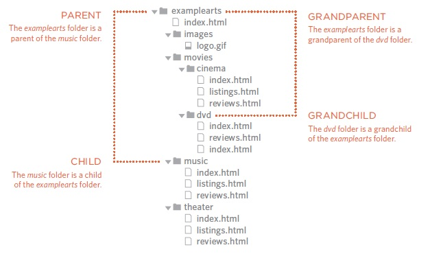
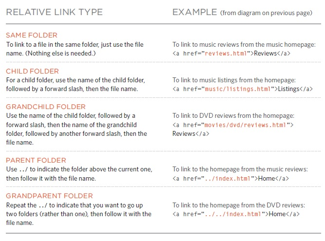
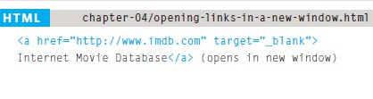

# HTML Links, JS Functions, and Intro to CSS Layout

[Reading-notes](https://odehyazan.github.io/reading-notes/)

## HTML Links

### HTML links are hyperlinks you can click on the link and move to part of the page or to new page the link can be a text, image or any other elements from HTML

### How we can write the links ?

#### to create link we use `<a>` element opening `<a>` tag and the closing `</a>` tag the page and we use `href` to specify the page or other sites.

**Now when we linking to other pages on the same site we use `<a>` tag also with something called Relative URL meaning When you are linking to other pages within the same site, you do not need to specify the domain name in the URL when they are in the same domain.**

**Different domains need other URL path :**

**The path to the homepage of this site is `www.examplearts.com index.html` The path to the logo for the site is `www.examplearts.com/images/logo.gif`. or we use the Relative URL.**

**Now about Email Links we use the `mailto:` inside the `href` in the `<a>` value of the `href` attribute starts with `mailto:` and is followed by the email address you want the email to be sent to.**

#### HOW Open Links in a New Window

**We use for that `target` attribute on the opening `<a>` tag. The value of this attribute should be _blank.**

