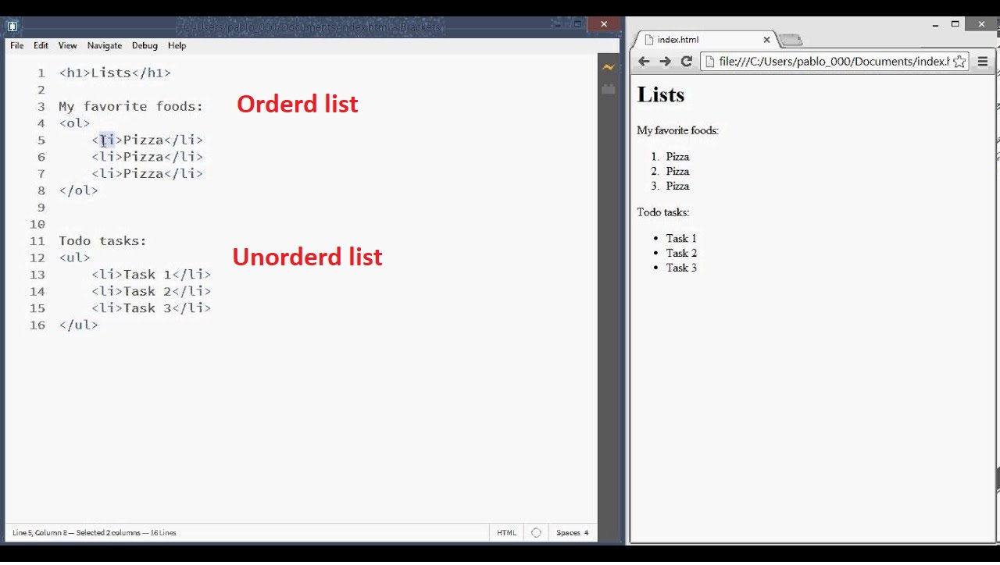

# HTML Links, JS Functions, and Intro to CSS Layout

[Reading-notes](https://odehyazan.github.io/reading-notes/)

## HTML Links

### HTML links are hyperlinks you can click on the link and move to part of the page or to new page the link can be a text, image or any other elements from HTML

### How we can write the links ?

#### to create link we use `<a>` element opening `<a>` tag and the closing `</a>` tag the page and we use `href` to specify the page

