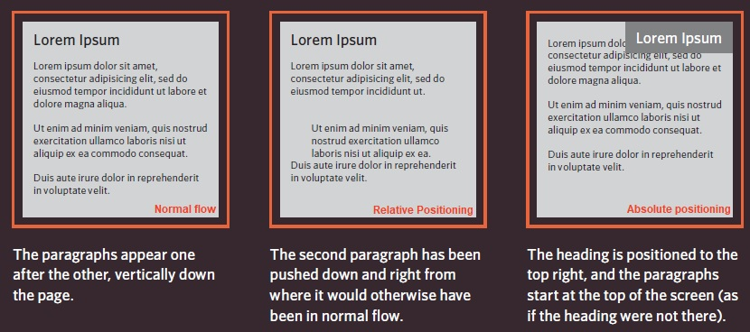
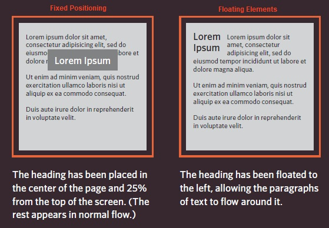

# HTML Links, JS Functions, and Intro to CSS Layout

[Reading-notes](https://odehyazan.github.io/reading-notes/)

## HTML Links

### HTML links are hyperlinks you can click on the link and move to part of the page or to new page the link can be a text, image or any other elements from HTML

### How we can write the links ?

#### to create link we use `<a>` element opening `<a>` tag and the closing `</a>` tag the page and we use `href` to specify the page or other sites.

**Now when we linking to other pages on the same site we use `<a>` tag also with something called Relative URL meaning When you are linking to other pages within the same site, you do not need to specify the domain name in the URL when they are in the same domain.**

**Different domains need other URL path :**

**The path to the homepage of this site is `www.examplearts.com index.html` The path to the logo for the site is `www.examplearts.com/images/logo.gif`. or we use the Relative URL.**

**Now about Email Links we use the `mailto:` inside the `href` in the `<a>` value of the `href` attribute starts with `mailto:` and is followed by the email address you want the email to be sent to.**

#### HOW Open Links in a New Window

**We use for that `target` attribute on the opening `<a>` tag. The value of this attribute should be _blank.**

**WE use in the `hrf` the id for  specific part of HTML to link this part of the page directly.**

## LAYOUT

 **we are going to look at how to control where each element sits on a page and how to create attractive page layouts.**

 ## Key Concepts in Positioning Elements

**First we have the Building Blocks, CSS treats each HTML element as if it is in its own box. This box will either be a block-level box or an inline box   1. Block-level elements , they start on new line (`<h1> 
 <ul> <li>`).  2. Inline elements flow in between surrounding text (` <b> <i>`).**
 

 **Containing Elements, If one block-level element sits inside another block-level element then the outer box is known as the containing or parent element we usually group elemnts in `
` element that contains this group of elements is then referred to as the containing element.**

  

 ***the `
` is orange border***

## How to control the postion of elements ?

**CSS has positioning schemes that allow you to control the layout of a page.  1 .Normal flow, Every block-level element
appears on a new line this is the default behavior unless you tell the browser to do something else.  2 .Relative Positioning, this moves an element from the position it would be in normal flow shifting it to the top, right,bottom, or left of where it without affecting the position of surrounding elements.  3.Absolute positioning, This positions the element in relation to its containing element and it move as users scroll up and down the page.**

## Box offset

**We use Box offset properties To indicate where a box should be positioned telling the browser how far from the top or bottom and left or right it should be placed.  1. Fixed Positioning, This is a form of absolute positioning that positions the element in relation to the browser window,fixed positioning do not affect the position of surrounding elements and they do not move when the user scrolls up or down the page.  2 . Floating Elements, Floating an element allows you to take that element out of normal flow and position
it to the far left or right of a
containing box, and it becam a block element.**

## Functions, Methods, and Objects

**Programmers use functions, methods, and objects to organize their code.   WHAT IS A FUNCTION? Functions let you group a series of statements together to perform a specific task.**

### DECLARING A FUNCTION AND CALLING

**To create a function we give it a name and then write the statements needed to achieve its task inside the curly brackets.**

**Declaring function that need information.**

**Calling function need information.**

**now when we `return` values from the function we use array.**