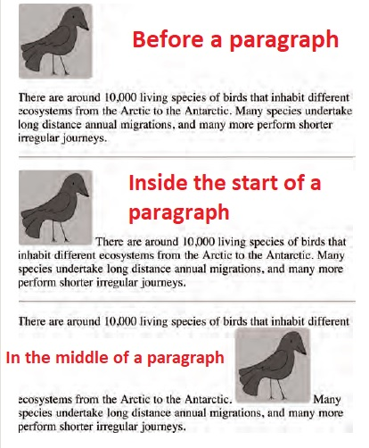

# HTML Images; CSS Color & Text

[Reading-notes](https://odehyazan.github.io/reading-notes/)

## IMAGES

**A picture can say a thousand words, and great
images help make the difference between an
average-looking site and a really attractive  one.**

### How we can add an image ?

**We can add images by using the `` element `src` tell the browser image source `alt` is image description if we can't see it and the `title` provide additional information about the image Most browsers will display the content of this attribute in a tootip when the user hovers over the image.**

**`*`Changing image use two other attributes that specify its size height This specifies the height of the image in pixels and width This specifies the width of the image in pixels**
``

**`*`Where to Place Images in Your Code ?  1. Before a paragraph  2. Inside the start of a paragraph. 3. In the middle of a paragraph.**

**`*`Must know that You should save images at the size you will be using them on the web page and in the appropriate format, photographs are best saved as JPEGs; illustrations or logos that use flat colors are better saved as GIFs.**

### COLOR

**Color not only brings your s XX ite to life, but also helps convey the mood and evokes reactions.**

**How we can specify colors in CSS ?  There is three ways. 1.RGB values. 2.Hex codes. 3.Color names.**

**It is important to ensure that there is enough contrast
between any text and the background color, we have also the RGBA (an extra value for RGB) introduced by CSS3, also It allows you to specify colors as HSL values, with an optional opacity value. It is known as HSLA.**

### TEXT

**There are properties to control the choice of font, size,
weight, style, and spacing.**
**1. ***Font-family*** property allows you to specify the typeface that should be used for any text inside the element(s) to which a CSS rule applies**
**2. ***Font-size*** property enables you to specify a size for the font by using pixels, percentages or ems ( em is equivalent to the width of a letter m).**

***Units of Type Size:***

