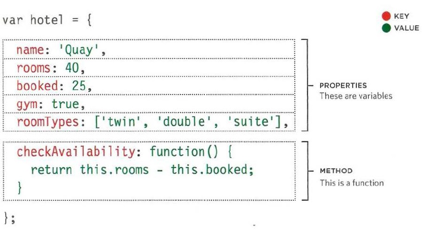
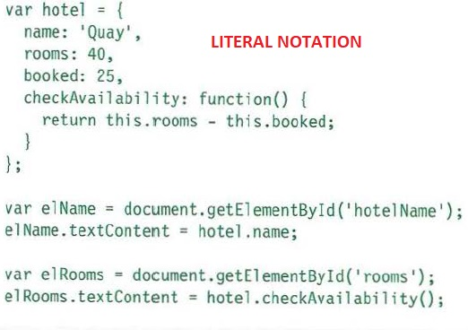
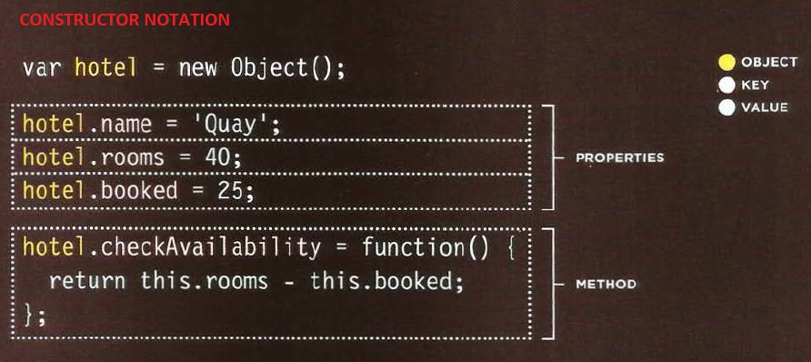
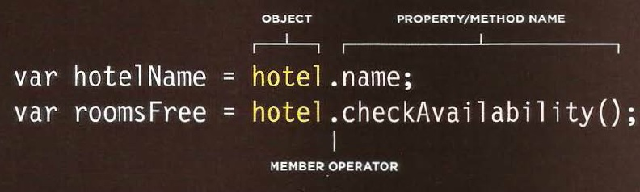

# JS Object Literals; The DOM

[Reading-notes](https://odehyazan.github.io/reading-notes/)

## OBJECT

### WHAT IS AN OBJECT?

**Objects group together a set of variables and functions to create a model of a something you would recognize from the real world and in the object the variable is part of it called a Property while the functions called Methods**

### Creating Objects 
 
**We have two ways to create objects 1. LITERAL NOTATION. 2. CONSTRUCTOR NOTATION**

### how we can access the object ?

**We can access the object by using something called DOT Notation.**

