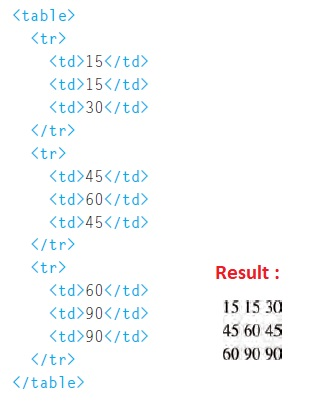
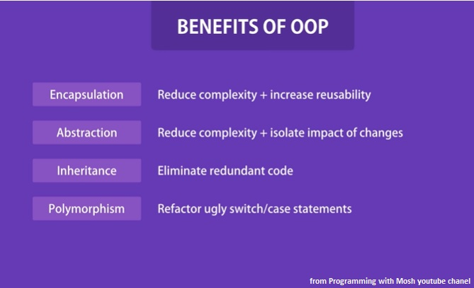
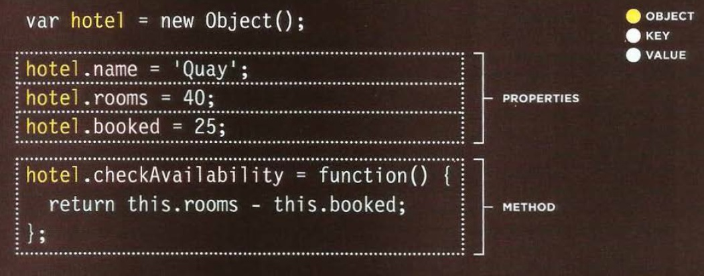
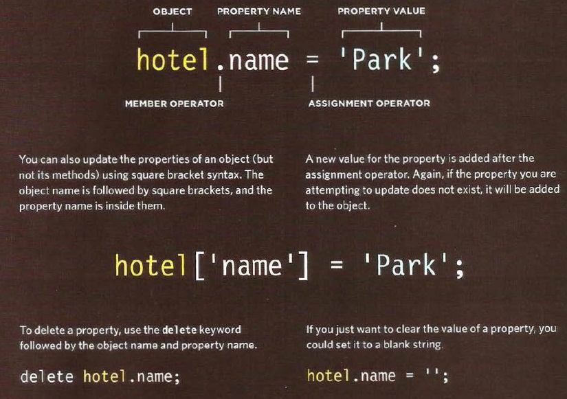

# Object-Oriented Programming, HTML Tables

[Reading-notes](https://odehyazan.github.io/reading-notes/)

## TABLES

### What's a Table?

**A table represents information in a grid format.
Examples of tables include financial reports, TV
schedules, and sports results.**

### how to create tables ?

**Basic Table Structure is created by `<table>` element used to create a table,`<tr>` tag ( table row) used to indicate the start of each row and `<td>`(table data).**

**Table Headings `<th>` (table heading) used just like the `<td>` element but its purpose is to represent the heading for either a column or a row now you should still use a `<td>` or `<th>` element to represent the presence of an empty cell otherwise the table will not render correctly,using `<th>` elements for headings helps people to improve search and styling in CSS also we can use the scope attribute on the `<th>` element to indicate whether it is a heading for a column or a row using the value `row` for the row and `col` for colum.**

**Long Tables There are three elements that help distinguish between the main content of the table and the first and last rows `<thead>` should contain headings of the table `<tbody>` contain the body and `<tfoot>` contain the footer that also help in CSS styling.**

## Object-Oriented

### Creating  an object constructor notation ?

**The `new` keyword and the object constructor create a blank object, we can then add properties and methods to object but to create empty object in literal notation use `let hotel={}`**

**We can update the object properties using Dot notation or square brackets work for both creating object methods literal or constructor notation to delete properties use the `delete` keyword.**  

