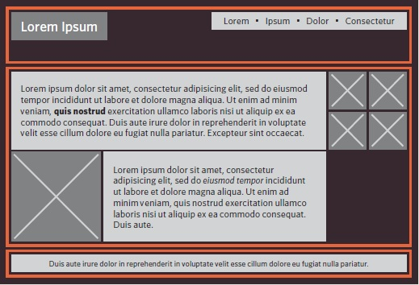
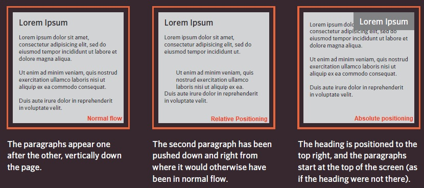
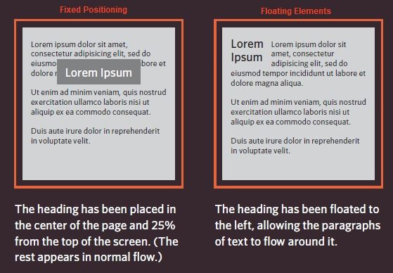
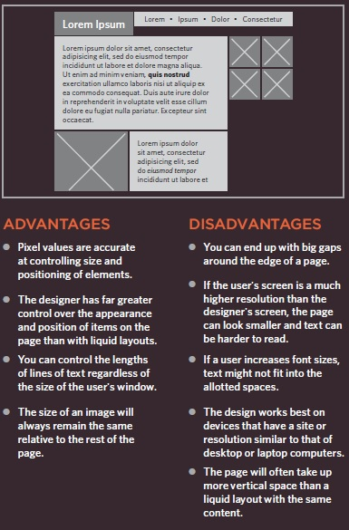

# CSS Layout

[Reading-notes](https://odehyazan.github.io/reading-notes/)

## Key Concepts in Positioning Elements

**First we have the Building Blocks, CSS treats each HTML element as if it is in its own box. This box will either be a block-level box or an inline box   1. Block-level elements , they start on new line (`<h1> 
 <ul> <li>`).  2. Inline elements flow in between surrounding text (` <b> <i>`).**
 

 **Containing Elements, If one block-level element sits inside another block-level element then the outer box is known as the containing or parent element we usually group elemnts in `
` element that contains this group of elements is then referred to as the containing element.**

  

 ***the `
` is orange border***

## How to control the postion of elements ?

**CSS has positioning schemes that allow you to control the layout of a page.  1 .Normal flow, Every block-level element
appears on a new line this is the default behavior unless you tell the browser to do something else.  2 .Relative Positioning, this moves an element from the position it would be in normal flow shifting it to the top, right,bottom, or left of where it without affecting the position of surrounding elements.  3.Absolute positioning, This positions the element in relation to its containing element and it move as users scroll up and down the page.**

## Box offset

**We use Box offset properties To indicate where a box should be positioned telling the browser how far from the top or bottom and left or right it should be placed.  1. Fixed Positioning, This is a form of absolute positioning that positions the element in relation to the browser window,fixed positioning do not affect the position of surrounding elements and they do not move when the user scrolls up or down the page.  2 . Floating Elements, Floating an element allows you to take that element out of normal flow and position
it to the far left or right of a
containing box, and it becam a block element.**

## Screen Sizes

**Different visitors to your site will have different sized screens that show different amounts of information, so your design needs to be able to work on a range of different sized screens.**

## Screen Resolution

**Resolution refers to the number of dots a screen shows per inch. Some devices have a higher resolution than desktop computers and most operating systems allow users to adjust the resolution of their screens.**

## Page Sizes

**Screen sizes and display resolutions vary so much, so web designers often try to create pages of around 960-1000 pixels wide.**

## Fixed Width Layouts

**Fixed width layout designs do not change size as the user increases or decreases the size of their browser window.**

