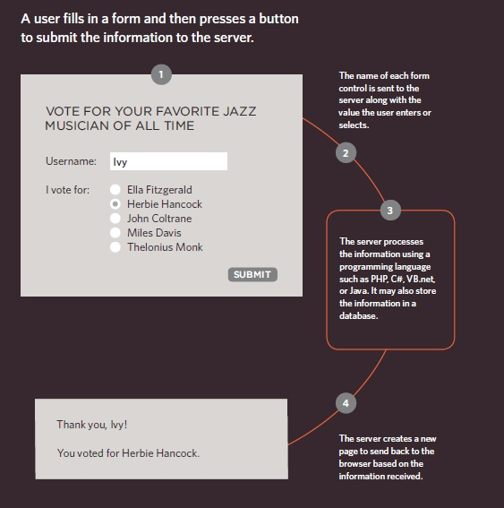
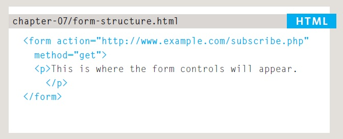

# Forms and JS Events

[Reading-notes](https://odehyazan.github.io/reading-notes/)

## Forms

**Traditionally, the term 'form' has referred to a printed document that contains spaces for you to fill in information, but in HTML borrows the concept of a form to refer to different elements that allow you to collect information from visitors to your site.**

### Form Controls

**ADDING TEXT: 1.Text input(single-line) 2.Password input 3.Text area (multi-line)**

**Making Choices: 1.Radio buttons 2.Checkboxes 3.Drop-down boxes**

**Submitting Forms: 1.Submit buttons 2.Image buttons**

**Uploading Files: File upload**

***How forms work?***

 

 **A form may have several form controls, each gathering different information. The server needs to know which piece of inputted data corresponds with which form element.**

 ### Form Structure

 **Form controls live inside a `<form>` element. This element should always carr the action attribute and will usually have a method and id attribute too.**

 **`action` Every `<form>` element requires an action attribute. Its value is the URL for the page on the server that will receive the information in the form when it is submitted.**

 **`method` Forms can be sent using one of two methods: `get` or `post`.**

 **`id`value is used to identify the form distinctly from other elements on the page(and is often used by scripts — such as those that check you have entered information into fields that require values).**

 

#### Text Input

 

#### Password Input

 

#### Checkbox, Radio  Input

 

#### date,Email and Number Input

 
