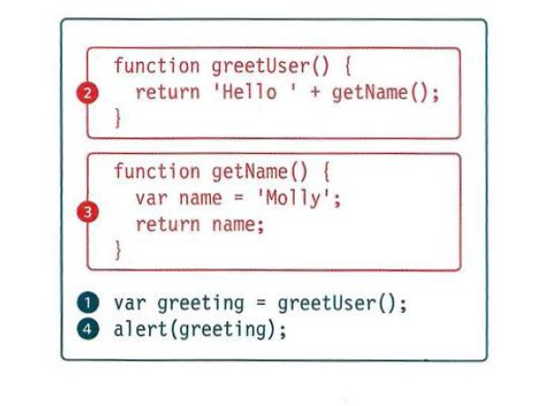
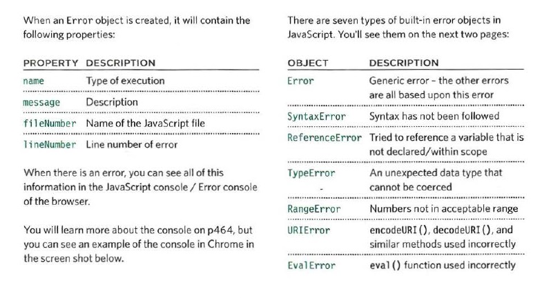
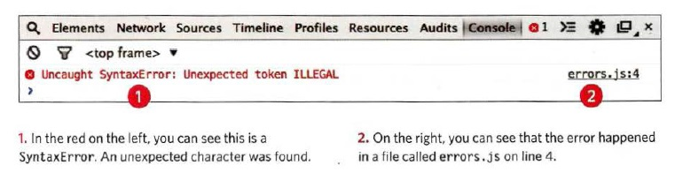

# Debugging

**JavaScript can be hard to learn and everyone makes mistakes when writing it. now how to find the errors in your code. and we will  also learn you how to write scripts that deal with potential errors gracefully.**

**When writing a long script, nobody gets everything right in their first attempt. The error messages that a browser gives look cryptic at first, but they can help you determine what went wrong in your JavaScript and how to fix it. In this read we will learn about:  1.THE CONSOLE & DEV TOOLS Tools built into the browser that help you hunt for errors. 2.COMMON PROBLEMS Common sources of errors, and how to solve them. 3.HANDLING ERRORS How code can deal with potential errors gracefully.**

## ORDER OF EXECUTION

**To find the source of an error, it helps to know how scripts are processed. The order in which statements are executed can be complex; some tasks cannot complete until another statement or function has been run:**

## EXECUTION CONTEXTS

**Every statement in a script lives in one of three execution contexts: 1.GLOBAL CONTEXT (Code that is in the script, but not in a function. There is only one global context in any page.) 2.FUNCTION CONTEXT(Code that is being run within a function. Each function has its own function context.)<be>3.EVAL CONTEXT (NOT SHOWN) Text is executed like code in an internal function called `eva l {)` (which is not covered in this book).**

## VARIABLE SCOPE

**The first two execution contexts correspond with the notion of scope  1.GLOBAL SCOPE If a variable is declared outside a function, it can be used anywhere because it has global scope. If you do not use the var keyword when creating a variable, it is placed in global scope.2.FUNCTION-LEVEL SCOPE When a variable is declared within a function, it can only be used within that function. This is because it has function-level scope.**

## UNDERSTANDING SCOPE

**each execution context has its own va ri ables object It holds the variables, functions, and parameters available within it. Each execution context can also access its parent's v a ri ables object.**

## UNDERSTANDING ERRORS

**If a JavaScript statement generates an error, then it throws an exception. At that point, the interpreter stops and looks for exception-handling code.**

### ERROR OBJECTS

**Error objects can help you find where your mistakes are and browsers have tools to help you read them.**

**Example:**

## HANDLING EXCEPTIONS

***If you know that you may get an error, you can handle it gracefully using the `try`, `catch`, `finally`statements. Use them to give your users helpful feedback***

### TRY

**First, you specify the code that you think might throw an exception within the try block. If an exception occurs in this section of code, control is automatically passed to the corresponding catch block.The try clause must be used in this type of error handling code, and it should always have either a catch, finally, or both. If you use a continue, break, or return keyword inside a try, it will go to the f i na 11 y option.**

### CATCH

**If the try code block throws an exception, catch steps in with an alternative set of code. It has one parameter: the error object. Although it is optional you are not handling the error if you do not catch an error. The ability to catch an error can be very helpful if there is an issue on a live website. It lets you tell users that something has gone wrong (rather than not informing them why the site stopped working).**

### FINALLY

**The contents of the fi na 11 y code block will run either way - whether the try block succeeded or failed It even runs if a return keyword is used in the try or catch block. It is sometimes used to clean up after the previous two clauses. These methods are similar to the .`done()`, . `fail()` , and . a 1 `ways()` methods in jQuery. You can nest checks inside each other (place another t ry inside a catch), but be aware that it can affect performance of a script.**

