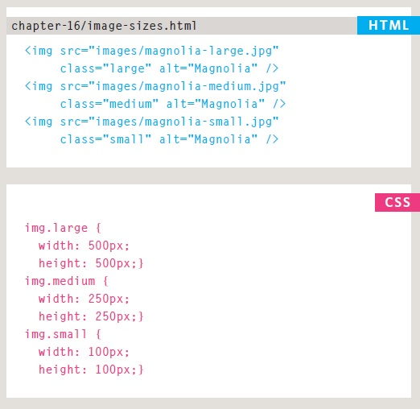
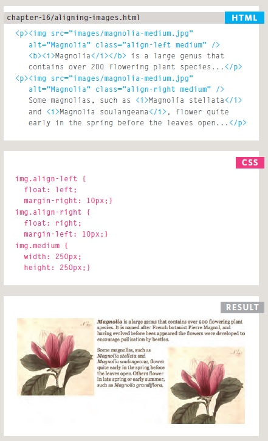
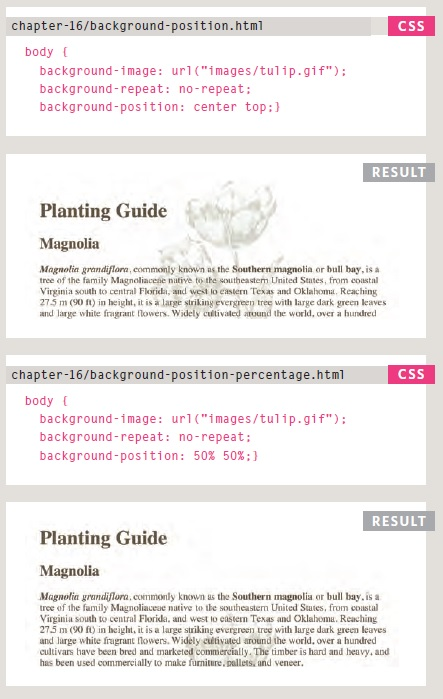

# Audio, Video, Images

[Reading-notes](https://odehyazan.github.io/reading-notes/)

## Controlling sizes of images in CSS

**You can control the size of an image using the width and height properties in CSS, just like you can for any other box, specifying image sizes helps pages to load more smoothly because the HTML and CSS code will often load before the images, and telling the browser how much space to leave for an image allows it to render the rest of the page without waiting for the image to download.**

**There is commonly image sizes used on all pages such as : Small portrait: 220 x 360 Small landscape: 330 x 210 Feature photo: 620 x 400.**

## AligNi ng images Using CSS

**Rather than using the `` element's align attribute, web page authors are increasingly using the float property to align images. There are two ways that this is commonly achieved:  1: The float property is added to the class that was created to represent the size of the image (such as the small class in our example).  2: New classes are created with names such as align-left or align-right to align the images to the left or right of the page These class names are used in addition to classes that indicate the size of the image.**

## Centering images Using CSS

## Background Images

**The background-image property allows you to place an image behind any HTML element. This could be the entire page or just part of the page. By default, a background image will repeat to fill the entire box, the path to the image follows the letters `url`, and it is put inside parentheses and quotes.**

## Repeating Images

### Background-repeat

### Background-attachment

**The background-repeat property can have four values:  `repeat` The background image is repeated both horizontally and vertically (the default way it is shown if the background repeat property isn't used `repeat-x` The image is repeated horizontally only (as shown in the first example on the left). `repeat-y` The image is repeated vertically only `no-repeat` The image is only shown once.  The background-attachment property specifies whether a background image should stay in one position or move as the user scrolls up and down the page. It can have one of two values:  `fixed` The background image stays in the same position on the page.`scroll` The background image moves up and down as the user scrolls up and down the page.**

## Background Position

**When an image is not being repeated, you can use the background-position property to specify where in the browser window the background image should be placed This property usually has a pair of values.  The first represents the horizontal position and the second represents the vertical.  left top  left center  left bottom  center top  center center  center bottom  right top  right center  right bottom.**

