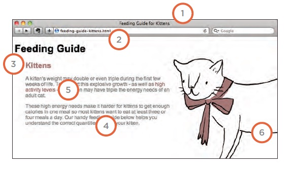

# Audio, Video, Images

[Reading-notes](https://odehyazan.github.io/reading-notes/)

## Controlling sizes of images in CSS

**You can control the size of an image using the width and height properties in CSS, just like you can for any other box, specifying image sizes helps pages to load more smoothly because the HTML and CSS code will often load before the images, and telling the browser how much space to leave for an image allows it to render the rest of the page without waiting for the image to download.**

**There is commonly image sizes used on all pages such as : Small portrait: 220 x 360 Small landscape: 330 x 210 Feature photo: 620 x 400.**

## AligNi ng images Using CSS

**Rather than using the `` element's align attribute, web page authors are increasingly using the float property to align images. There are two ways that this is commonly achieved:  1: The float property is added to the class that was created to represent the size of the image (such as the small class in our example).  2: New classes are created with names such as align-left or align-right to align the images to the left or right of the page These class names are used in addition to classes that indicate the size of the image.**

## Centering images Using CSS

## Background Images

**The background-image property allows you to place an image behind any HTML element. This could be the entire page or just part of the page. By default, a background image will repeat to fill the entire box, the path to the image follows the letters `url`, and it is put inside parentheses and quotes.**

## Repeating Images

### Background-repeat

### Background-attachment

**The background-repeat property can have four values:  `repeat` The background image is repeated both horizontally and vertically (the default way it is shown if the background repeat property isn't used `repeat-x` The image is repeated horizontally only (as shown in the first example on the left). `repeat-y` The image is repeated vertically only `no-repeat` The image is only shown once.  The background-attachment property specifies whether a background image should stay in one position or move as the user scrolls up and down the page. It can have one of two values:  `fixed` The background image stays in the same position on the page.`scroll` The background image moves up and down as the user scrolls up and down the page.**

## Background Position

**When an image is not being repeated, you can use the background-position property to specify where in the browser window the background image should be placed This property usually has a pair of values.  The first represents the horizontal position and the second represents the vertical.  left top  left center  left bottom  center top  center center  center bottom  right top  right center  right bottom.**

## Search Engine Optimization (SEO ) 

**SEO is a huge topic and several books have been written on the subject. The following pages will help you understand the key concepts so you can improve your website's visibility on search engines.**

### On-Page Techniques

**On-page techniques are the methods you can use on your web pages to improve their rating in search engines.**

**1: Page Title 2: URL / Web Address 3: Headings 4: Text 5: Link Text 6: Image Alt Text 7: Page Descriptions.**

### Off-Page Techniques

**Getting other sites to link to you is just as important as on-page techniques. Search engines help determine how to rank your site by looking at the number of other sites that link to yours.**

#### How to Identify Keywords and Phrases

**1: Brainstorm List down the words that someone might type into Google to find your site. Be sure to include the various topics products or services your site is about.**

**2: Organize Group the keywords into separate lists for the different sections or categories of your website. For example if your website was a pet shop you might have different categories for different animals (such as dogs, cats and rabbits).**

**3: Research There are several tools that let you enter your keywords and then they will suggest additional keywords you might like to consider, such as: adwords.google.co.uk select KeywordToolExternal (When using this tool select the "exact match" option rather than "broad match.")  www.wordtracker.com www.keyworddiscovery.com.**

**4: Compare It is very unlikely that your site will appear at the top of the search results for every keyword. This is especially true for topics where there is a lot of competition. The more sites out there that have already been optimized for a given keyword, the harder it will be for you to rise up the search results when people search on that term.**

**5: Refine Now you need to pick which keywords you will focus on. These should always be the ones that are most relevant to each section of your site.**

**6: Map Now that you have a refined list of keywords, you know which have the most competition, and which ones are most relevant it is time to start picking which keywords you will use for each page. Pick 3-5 keywords or phrases that map to each page of your website and use these as the keywords for each page.**