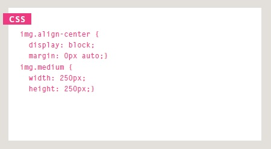

# Audio, Video, Images

[Reading-notes](https://odehyazan.github.io/reading-notes/)

## Controlling sizes of images in CSS

**You can control the size of an image using the width and height properties in CSS, just like you can for any other box, specifying image sizes helps pages to load more smoothly because the HTML and CSS code will often load before the images, and telling the browser how much space to leave for an image allows it to render the rest of the page without waiting for the image to download.**

**There is commonly image sizes used on all pages such as : Small portrait: 220 x 360 Small landscape: 330 x 210 Feature photo: 620 x 400.**

## AligNi ng images Using CSS

**Rather than using the `` element's align attribute, web page authors are increasingly using the float property to align images. There are two ways that this is commonly achieved:  1: The float property is added to the class that was created to represent the size of the image (such as the small class in our example).  2: New classes are created with names such as align-left or align-right to align the images to the left or right of the page These class names are used in addition to classes that indicate the size of the image.**

## Centering images Using CSS

