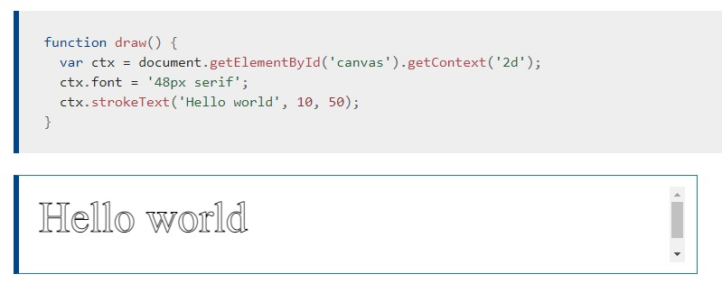

# Chart.js, Canvas

[Reading-notes](https://odehyazan.github.io/reading-notes/)

## Chart.js

### What is charts ?

**In general, a chart is a graphical representation of data. Charts allow users to see what the results of data to better understand and predict current and future data. The picture below contains an example of a column chart displaying the number of unique visitors Computer Hope has received between the years of 2000 and 2006. In this example, you'll notice a gentle increase of users without reading any data.**

### What is Chart.js ?

**Chart.js is a free open-source JavaScript library for data visualization, which supports 8 chart types: bar, line, area, pie, bubble, radar, polar, and scatter.**

### How to create a Chart

**It's easy to get started with Chart.js. All that's required is the script included in your page along with a single `<canvas>` node to render the chart.**

**First, we need to have a canvas in our page. It's recommended to give the chart its own container for.  `<canvas id="myChart" width="400" height="400"></canvas>`**

**Now that we have a canvas we can use, we need to include Chart.js in our page.  ``**

**This `<script>` tag should be before your `<script>` tag in the HTML.**

## Canvas

### What is Canvas ?

**The HTML `<canvas>` element is used to draw graphics on a web page so it is basically a container.`<canvas id="tutorial" width="150" height="150"></canvas>`,the `<canvas>` element has only two attributes, width and height. These are both optional and can also be set using DOM properties. When no width and height attributes are specified, the canvas will initially be 300 pixels wide and 150 pixels high. The element can be sized arbitrarily by CSS.**

### rendering context

**The canvas is initially blank. To display something, a script first needs to access the rendering context and draw on it. The `<canvas>` element has a method called `getContext(),` used to obtain the rendering context and its drawing `functions. getContext()` takes one parameter, the type of context. For `2D` graphics, such as those covered by this tutorial, you specify "2d" to get a CanvasRenderingContext2D**

`var canvas = document.getElementById('tutorial');`
`var ctx = canvas.getContext('2d');`

### Drawing shapes with canvas

**`<canvas>` only supports two primitive shapes: rectangles and paths (lists of points connected by lines). All other shapes must be created by combining one or more paths. Luckily, we have an assortment of path drawing functions which make it possible to compose very complex shapes.**

### Applying styles and colors

#### Colors

**Until now we have only seen methods of the drawing context. If we want to apply colors to a shape, there are two important properties we can use: `fillStyle` and `strokeStyle`.**

**The valid strings you can enter should, according to the specification, be CSS `<color>` values. Each of the following examples describe the same color.**

**A fillStyle example:**

**A strokeStyle example, is similar to the one above, but uses the strokeStyle property to change the colors of the shapes' outlines. We use the `arc()` method to draw circles instead of squares.**

#### Drawing text

**The canvas rendering context provides two methods to render text:  `fillText(text, x, y [, maxWidth])`Fills a given text at the give (x,y) position. Optionally with a maximum width to draw. `strokeText(text, x, y [ maxWidth])` Strokes a given text at the give (x,y) position. Optionally with a maximum width to draw.**

**A fillText example: The text is filled using the current `fillStyle`.**

**A strokeText example: The text is filled using the current `strokeStyle`.**

