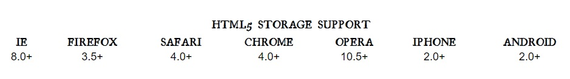
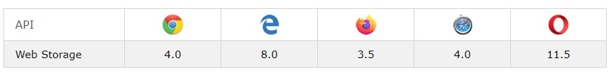
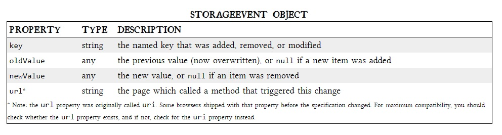
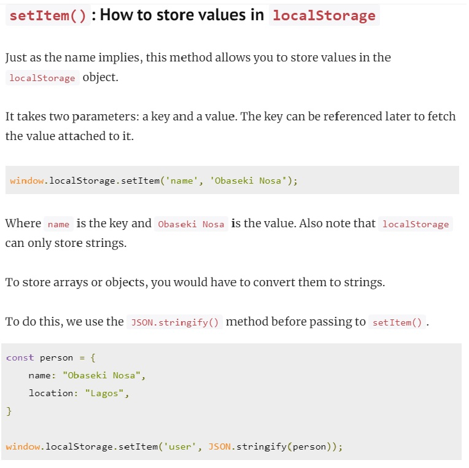
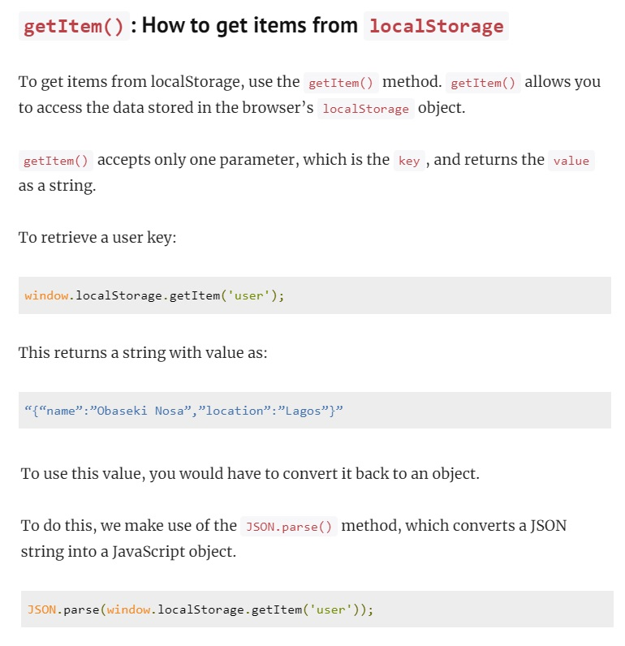
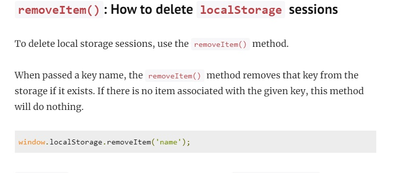
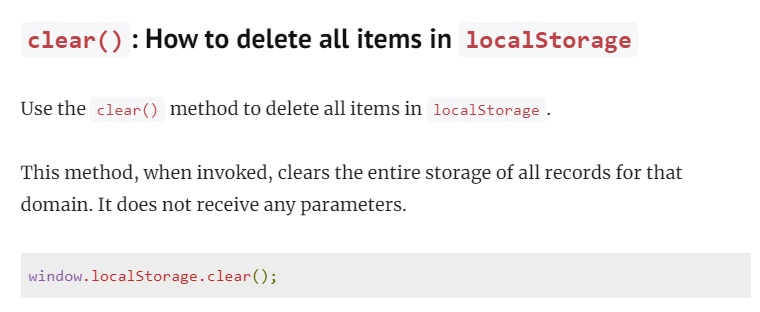
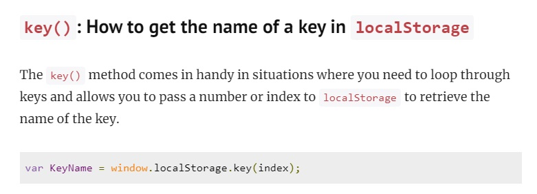

# LOCAL STORAGE FOR WEB APPLICATIONS

[Reading-notes](https://odehyazan.github.io/reading-notes/)

## What is local storage

**The localStorage and sessionStorage properties allow to save key/value pairs in a web browser. The localStorage object stores data with no expiration date. The data will not be deleted when the browser is closed, and will be available the next day, week, or year. The localStorage property is read-only.**

**In the local storage Cookies were invented early in the web’s history, and indeed they can be used for persistent local storage of small amounts of data. But they have three potentially dealbreaking downsides:** 

**1.Cookies are included with every HTTP request, thereby slowing down your web application by needlessly transmitting the same data over and over.  2.Cookies are included with every HTTP request, thereby sending data unencrypted over the internet (unless your entire web application is served over SSL)  3.Cookies are limited to about 4 KB of data — enough to slow down your application (see above), but not enough to be terribly useful.**

### INTRODUCING HTML5 STORAGE

**HTML5 Storage is a specification named Web Storage, which was at one time part of the HTML5 specification proper,ertain browser vendors also refer to it as “Local Storage” or “DOM Storage.” local storage, it is implemented natively in web browsers, so it is available even when third-party browser plugins are not.**

**Now which browsers support the HTML5 Storage and which version.**

**STORAGE EVENT OBJECT.**

## How does localStorage work?

### HOW To use `localStorage` in your web applications, there are five methods to choose from

**To use `localStorage` in your web applications, there are five methods to choose from:**

**1.`setItem()`: Add key and value to `localStorage`.  2.`getItem()`: This is how you get items from `localStorage`.  3.`removeItem()`: Remove an item by key from `localStorage`  4.`clear()`: Clear all `localStorage`  5.`key()`: Passed a number to retrieve the key of a `localStorage`.**

***References***
[javascript in plain Englis](https://javascript.plainenglish.io/introduction-to-local-storage-with-javascript-821b7dfd25a)
[w3schools](https://www.w3schools.com/html/html5_webstorage.asp)
[logrocket](https://blog.logrocket.com/localstorage-javascript-complete-guide/)