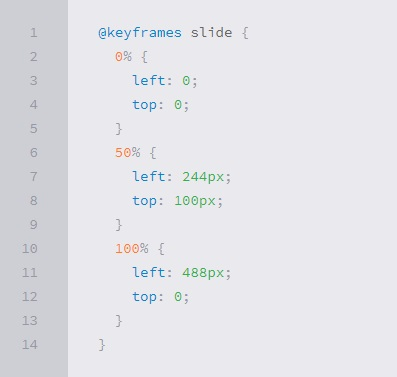
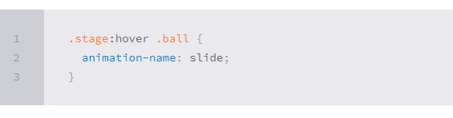

# CSS Transforms, Transitions, and Animations

[Reading-notes](https://odehyazan.github.io/reading-notes/)

**We  will introduce you to CSS transitions and CSS transforms: the CSS power couple. When used together, these properties allow you to create simple animations and add valuable interaction and visual feedback for your users, make sure The movement you create should convey meaning, always enhancing, not distracting from the interaction for your users.**

## CSS transforms 

**how to make an element change from one state to another. With the CSS transform property you can rotate, move, skew, and scale element,Transforms are triggered when an element changes states, such as on mouse-hover or mouse-click. The examples in this post will demonstrate transforms on mouse-hover.**

### scale

**The `scale` value allows you to increase or decrease the size of an element. For example, the value 2 would transform the size to be 2 times its original size. The value 0.5 would transform the size to be half its original size. You can scale an element by setting parameters for the width (X-axis) or height (Y-axis). For example, transform: scaleX(2), or use the scale() shorthand to scale both axes at the same time: transform: scale(2);. Or define them independently of each other: transform: scale(2, 4);**

**CSS Syntax `div {` `transition: transform 1s;` `}` `div:hover {` `transform: scale(2);` `}`**
  
### rotate
 **With the `rotate` value, the element rotates clockwise or counterclockwise by a specified number of degrees. A positive value, such as `90deg`, rotates the element clockwise, while a negative value, such as `-90deg`, rotates it counterclockwise. You can rotate more than a full rotation with numbers over than 360, such as 1080deg, for three full rotations.**

**CSS syntax `div {` `transition: transform 1s;` `}` `div:hover {` `transform: rotate(1080deg);` `}`**

### translate

**The translate value moves an element left/right and up/down. The movement is based on the parameters given for the X (horizontal) Y (vertical) axes.  A positive X value moves the element to the right, while a negative X moves the element to the left. A positive Y value moves the element downwards and a negative Y value, upwards.  In this example, the element will move 20 pixels to the right and 20 pixels down.**

**CSS syntax `div {` `transition: transform 1s;` `}` `div:hover {` ` transform: translate(20px, 20px);` `}`**

### skew

**With the `skew` value, the element skews (or tilts) one direction or the other based on the values given for the X and Y axes. A positive X value tilts the element left, while a negative X value tilts it right. A positive Y value tilts the element down, and a negative Y value tilts is up. Or use a shorthand to include both X and Y properties:**

**CSS syntax `div {` `transform: skewX(25deg);` `transform: skewY(10deg);` `transform: skew(25deg, 10deg);` `}`**

## Transitions

**Transitions are the grease in the wheel of CSS transforms. Without a transition, an element being transformed would change abruptly from one state to another. By applying a transition you can control the change, making it smooth and gradual. There are two properties that are required in order for the transition to take effect: 1.transition-property 2.transition-duration**

### transition-property

**The `transition-property` specifies the CSS property where the transition will be applied. You may apply a transition to an individual property (e.g., background-color or tranform) or to all properties in the rule-set (i.e., all).**

**CSS syntax `div {` `transition-property: all;` `transition-property: transform;` `}`**

### transition-duration

**The transition-duration property specifies the time span of the transition. You can specify in seconds or milliseconds.**

**CSS syntax `div {` `transition-duration: 3s;` `}`**

### transition-timing

**The `transition-timing-function` property allows you to define the speed of the transition over the duration. The default timing is ease, which starts out slow, quickly speeds up, and then slows down at the end. The other timing options are: `linear`, `ease`, `ease-in`, `ease-out`, and `ease-in-out`.**

**CSS syntax transition-timing-function `div {` `transition: all 3s ease-in-out;` `}`**

## Animations

**Transitions do a great job of building out visual interactions from one state to another, and are perfect for these kinds of single state changes. However, when more control is required, transitions need to have multiple states. In return, this is where animations pick up where transitions leave off.**

### Animations Keyframes

**To set multiple points at which an element should undergo a transition, use the `@keyframes` rule. The `@keyframes` rule includes the animation name, any animation breakpoints, and the properties intended to be animated.**

### Animation Name

**Once the `keyframes` for an animation have been declared they need to be assigned to an element. To do so, the `animation-name` property is used with the animation name, identified from the `@keyframes` rule, as the property value. The `animation-name` declaration is applied to the element in which the animation is to be applied to.**

