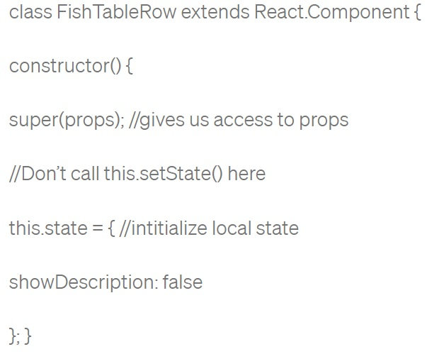

# State and Props

## Component Lifecycle Events

**The methods that you are able to use on these are called lifecycle events,These methods can be called during the lifecycle of a component, and they allow you to update the UI and application states.**

**We have three phases of the component lifecycle. 1. Mounting(which is the first thing happened in the lifecycle of React). 2. Updating 3. Unmounting.**

**Thing in lifecycle happened in order: 1. Constructor. 2. Render. 3. React Updates. 4. ComponentDidMount.(used  load anything using a network request or initialize the DOM and it is good to set any subscriptions) 5. ComponentWillUnmount**

**`Cnstructor()` The constructor for a React component is called before it is mounted.If the component is a subclass you should call super(props), or the props will be undefined and it can be used to assign state using `this.state`(avoid using it can lead to side effects).  EX:**

**`ComponentDidMount()` This method is invoked immediately after a component is mounted, we use it to load anything using a network request or initialize the DOM, `setState()` can be called here, but it should be used sparingly, because it will cause a rerender, which can lead to performance issues. This method is good  to set up any subscriptions. If you do that, don’t forget to unsubscribe in componentWillUnmount().**

## React State Vs Props

**State" is data that changes over the lifetime of a specific instance of a React component.**

**Props (short for Properties) is an object of inputs a React function component accepts as the first argument.**

**What types of things can you pass in the props?  We can pass values to children these values can be any data type, from strings to functions, objects, etc.**

**What is the big difference between props and state? State is the local state of the component which cannot be accessed and modified outside of the component. It's equivalent to local variables in a function, While Props make components reusable by giving components the ability to receive data from their parent component in the form of props. They are equivalent to function parameters.**

**When do we re-render our application? Whenever there is a change in their state or props.**
**What are some examples of things that we could store in state? State is data that changes over time for ex: Clock, temperature, counters**