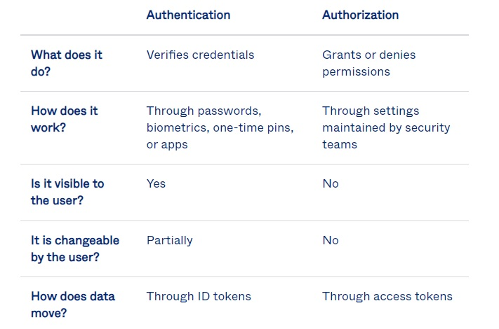

# Authentication

[Reading-notes](https://odehyazan.github.io/reading-notes/)

## What is OAuth

### What is OAuth?

**OAuth is an open-standard authorization protocol or framework that describes how unrelated servers and services can safely allow authenticated access to their assets without actually sharing the initial, related, single logon credential. In authentication parlance, this is known as secure, third-party, user-agent, delegated authorization.**

### Give an example of what using OAuth would look like

**The simplest example of OAuth is when you go to log onto a website and it offers one or more opportunities to log on using another website’s/service’s logon. You then click on the button linked to the other website, the other website authenticates you, and the website you were originally connecting to logs you on itself afterward using permission gained from the second website.**

### How does OAuth work? What are the steps that it takes to authenticate the user?

1. **The first website connects to the second website on behalf of the user, using OAuth, providing the user’s verified identity.**
2. **The second site generates a one-time token and a one-time secret unique to the transaction and parties involved.**
3. **The first site gives this token and secret to the initiating user’s client software.**
4. **The client’s software presents the request token and secret to their authorization provider (which may or may not be the second site).**
5. **If not already authenticated to the authorization provider, the client may be asked to authenticate. After authentication, the client is asked to approve the authorization transaction to the second website.**
6. **The user approves (or their software silently approves) a particular transaction type at the first website.**
7. **The user is given an approved access token (notice it’s no longer a request token).**
8. **The user gives the approved access token to the first website.**
9. **The first website gives the access token to the second website as proof of authentication on behalf of the user.**
10. **The second website lets the first website access their site on behalf of the user.**
11. **The user sees a successfully completed transaction occurring.**
12. **OAuth is not the first authentication/authorization system to work this way on behalf of the end-user. In fact, many authentication systems, notably Kerberos, work similarly. What is special about OAuth is its ability to work across the web and its wide adoption. It succeeded with adoption rates where previous attempts failed (for various reasons).**

### What is OpenID?

**OpenID is an open standard authentication protocol allowing users to log into multiple unrelated websites without having to have a separate identity and password for each, users create accounts by selecting an OpenID identity provider and then use those accounts to sign onto any website that accepts OpenID authentication.**

## Authorization and Authentication flows

### What is the difference between authorization and authentication?

### What is Authorization Code Flow?

**Authorization Code Flow (defined in OAuth 2.0 RFC 6749, section 4.1), which exchanges an Authorization Code for a token.**

### What is Authorization Code Flow with Proof Key for Code Exchange (PKCE)?

**The Authorization Code Flow + PKCE is an OpenId Connect flow specifically designed to authenticate native or mobile application users. This flow is considered best practice when using Single Page Apps (SPA) or Mobile Apps. PKCE, pronounced “pixy” is an acronym for Proof Key for Code Exchange.**

### What is Implicit Flow with Form Post?

**Implicit Flow with Form Post flow uses OIDC to implement web sign-in that is very similar to the way SAML and WS-Federation operates. The web app requests and obtains tokens through the front channel, without the need for secrets or extra backend calls.**

### What is Client Credentials Flow?

**The Client Credentials flow is a server to server flow. There is no user authentication involved in the process, so The client can request an access token using only its client credentials (or other supported means of authentication) when the client is requesting access to the protected resources under its control, or those of another resource owner that have been previously arranged with the authorization server (the method of which is beyond the scope of this specification).**

### What is Device Authorization Flow?

**The OAuth 2.0 Device Authorization Grant (formerly known as the Device Flow) is an OAuth 2.0 extension that enables devices with no browser or limited input capability to obtain an access token. This is commonly seen on Apple TV apps, or devices like hardware encoders that can stream video to a YouTube channel.**

### What is Resource Owner Password Flow?

**The Resource Owner Password Credentials flow allows exchanging the username and password of a user for an access token and, optionally, a refresh token. This flow has significantly different security properties than the other OAuth flows. The primary difference is that the user’s password is accessible to the application. This requires strong trust of the application by the user.**