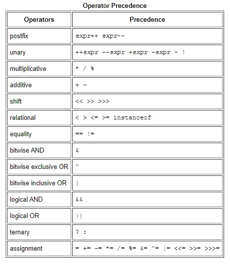

[Reading-notes](https://odehyazan.github.io/reading-notes/)

# Java Basics

## Variables

**A Java variable is a piece of memory that can contain a data value. A variable thus has a data type. Data types are covered in more detail in the text on Java data types. Variables are typically used to store information which your Java program needs to do its job.**

**1. The Java programming language defines the following kinds of variables:**
**Instance Variables (Non-Static Fields) Technically speaking, objects store their individual states in "non-static fields", that is, fields declared without the static keyword. Non-static fields are also known as instance variables because their values are unique to each instance of a class (to each object, in other words); the currentSpeed of one bicycle is independent from the currentSpeed of another.**

**2. Class Variables (Static Fields) A class variable is any field declared with the static modifier; this tells the compiler that there is exactly one copy of this variable in existence, regardless of how many times the class has been instantiated. A field defining the number of gears for a particular kind of bicycle could be marked as static since conceptually the same number of gears will apply to all instances. The code static int numGears = 6; would create such a static field. Additionally, the keyword final could be added to indicate that the number of gears will never change.**

**3. Local Variables Similar to how an object stores its state in fields, a method will often store its temporary state in local variables. The syntax for declaring a local variable is similar to declaring a field (for example, int count = 0;). There is no special keyword designating a variable as local; that determination comes entirely from the location in which the variable is declared — which is between the opening and closing braces of a method. As such, local variables are only visible to the methods in which they are declared; they are not accessible from the rest of the class.**

**4. Parameters You've already seen examples of parameters, both in the Bicycle class and in the main method of the "Hello World!" application. Recall that the signature for the main method is public static void main(String[] args). Here, the args variable is the parameter to this method. The important thing to remember is that parameters are always classified as "variables" not "fields". This applies to other parameter-accepting constructs as well (such as constructors and exception handlers).**

### Naming

**The rules and conventions for naming your variables can be summarized as follows:**

**1. Variable names are case-sensitive.**

**2. Subsequent characters may be letters, digits, dollar signs, or underscore characters, when choosing a name for your variables, use full words instead of cryptic abbreviations.**

**3. If the name you choose consists of only one word, spell that word in all lowercase letters. If it consists of more than one word, capitalize the first letter of each subsequent word.**

**The [keyword or reserved word in java](https://docs.oracle.com/javase/tutorial/java/nutsandbolts/_keywords.html).**

## Operators

**This section describes the operators of the Java programming language. It presents the most commonly-used operators first, and the less commonly-used operators last. Each discussion includes code samples that you can compile and run.**

## Expressions, Statements, and Blocks

**Operators may be used in building expressions, which compute values; expressions are the core components of statements; statements may be grouped into blocks. This section discusses expressions, statements, and blocks.**

### Expressions

**An expression is a series of variables, operators, and method calls (constructed according to the syntax of the language) that evaluates to a single value.**

### Statements

**Java statements are instructions that tell the programming language what to do, like declaration and string statements. Basic statements define variables and initiate Java methods or start the execution of blocks of other statements. Assignment statements assign values to variables.**

### Blocks

**A block in Java is a group of one or more statements enclosed in braces. A block begins with an opening brace ({) and ends with a closing brace (}). Between the opening and closing braces, you can code one or more statements. For example: { int i, j; i = 100; j = 200; } A block is itself a type of statement.**

## Control Flow Statements

**The statements inside your source files are generally executed from top to bottom, in the order that they appear. Control flow statements, however, break up the flow of execution by employing decision making, looping, and branching, enabling your program to conditionally execute particular blocks of code. This section describes the decision-making statements (if-then, if-then-else, switch), the looping statements (for, while, do-while), and the branching statements (break, continue, return) supported by the Java programming language.**

## Compiling

**When the computer runs a program, the program itself is made of a bunch of 1's and 0's.**

**However, since we still need humans to write our programs, putting everything in 1's and 0's (called machine language) would be very difficult. So we made higher level languages like Java and C# to write code in. These languages look a lot more like English, so they're a lot easier to write and maintain.**

**When you compile code, the compiler (usually another program) takes the program the human wrote, and converts it into the program the computer can understand (i.e. converts from Java to machine language). The very short version could be, yes, compile means to make the code executable.**

**Something you may run into is people saying code does or does not compile. This means the compiler they used checks to make sure their program is written correctly according to the rules of the programming language. For example, most programming languages make you put a semicolon `(;)` at the end of every line. A very common mistake is to forget that semicolon, so when you try and compile the compiler gives you an error.**

**It's also important to note that just because the code compiles doesn't mean it works. It's sort of like how 3 + 4 < 5 is an equation that has the right form, but it is incorrect.**

## Java Documentation

[Java Documentation](https://www.dummies.com/programming/java/making-sense-of-javas-api-documentation/)

**Once upon a time, people judged programming languages (including Java) solely by their grammatical features. Does an if statement do what you expect it to do? Are looping statements easy to use? Are methods implemented efficiently?**

**Nowadays, things are a bit different. Java has a whole collection of grammatical features, but Java is much more than just a big set of grammar rules. Java has a standard Application Programming Interface —a huge library consisting of over 4,000 classes, each with its own functionality, its own limitations, and its own rules for effective use.**

