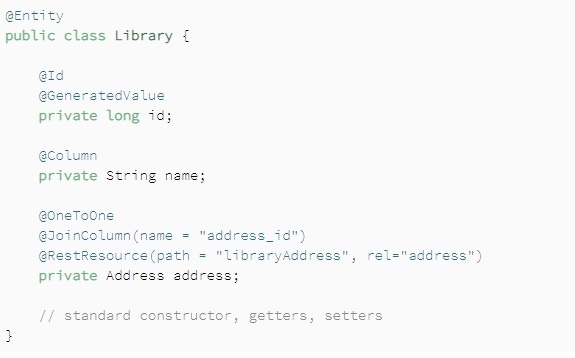
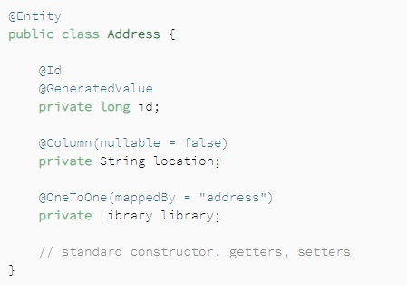

[Reading-notes](https://odehyazan.github.io/reading-notes/)

# Related Resources and Integration Testing

**how to work with relationships between entities in Spring Data REST.**
**We will focus on the association resources that Spring Data REST exposes for a repository, considering each type of relationship that can be defined.**

**To avoid any extra setup, we will use the H2 embedded database for the examples. You can see the list of required dependencies in our Introduction to Spring Data REST article.**

## One-to-One Relationship

**1.  The Data Model.**

**Let's define two entity classes Library and Address having a one-to-one relationship, using the @OneToOne annotation. The association is owned by the Library end of the association:** 

 

**The @RestResource annotation is optional and can be used to customize the endpoint.**

**We must be careful to have different names for each association resource. Otherwise, we will encounter a JsonMappingException with the message: “Detected multiple association links with same relation type! Disambiguate association”.**

## The Repositories
