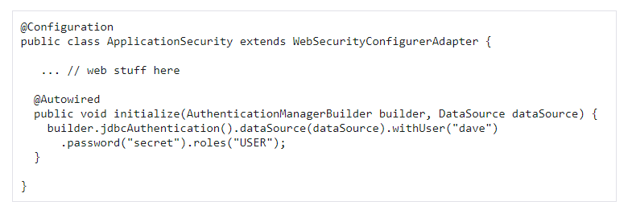
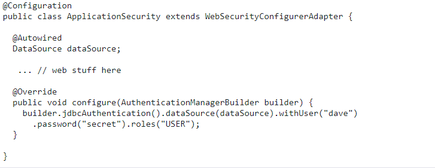

[Reading-notes](https://odehyazan.github.io/reading-notes/)

# Spring Authentication

## Spring Security Architecture

**Spring security is framework used for securing Spring applications. It stands between client and application and gives possibility of configuring what data and functionalities are exposed to which users. Also, it handles common vulnerabilities.**

## Authentication and Access Control

**Application security boils down to two more or less independent problems: authentication (who are you?) and authorization (what are you allowed to do?). Sometimes people say “access control” instead of "authorization", which can get confusing, but it can be helpful to think of it that way because “authorization” is overloaded in other places. Spring Security has an architecture that is designed to separate authentication from authorization and has strategies and extension points for both.**

### Authentication

**The main strategy interface for authentication is `AuthenticationManager`, which has only one method:**

**`public interface AuthenticationManager {`** 
  **`Authentication authenticate(Authentication authentication)`** 
    **`throws AuthenticationException;`** 
**`}`** 
 

**An `AuthenticationManager` can do one of 3 things in its authenticate() method:**

**1. Return an `Authentication` (normally with `authenticated=true`) if it can verify that the input represents a valid principal.**

**2. Throw an `AuthenticationException` if it believes that the input represents an invalid principal.**

**3. Return `null` if it cannot decide.**

**`AuthenticationException` is a runtime exception. It is usually handled by an application in a generic way, depending on the style or purpose of the application. In other words, user code is not normally expected to catch and handle it. For example, a web UI might render a page that says that the authentication failed, and a backend HTTP service might send a 401 response, with or without a `WWW-Authenticate` header depending on the context.**

**The most commonly used implementation of `AuthenticationManager` is`ProviderManager`, which delegates to a chain of `AuthenticationProvider` instances. An `AuthenticationProvider` is a bit like an AuthenticationManager, but it has an extra method to allow the caller to query whether it supports a given `Authentication` type:**

**`public interface AuthenticationProvider {`** 
  **`Authentication authenticate(Authentication authentication)`** 
    **`throws AuthenticationException;`** 
    **`boolean supports(Class<?> authentication);`** 
**`}`** 
 

**The Class<?> argument in the supports() method is really Class<? extends Authentication> (it is only ever asked if it supports something that is passed into the authenticate() method). A ProviderManager can support multiple different authentication mechanisms in the same application by delegating to a chain of AuthenticationProviders. If a ProviderManager does not recognize a particular Authentication instance type, it is skipped.**

**A ProviderManager has an optional parent, which it can consult if all providers return null. If the parent is not available, a null Authentication results in an AuthenticationException.**

**Sometimes, an application has logical groups of protected resources (for example, all web resources that match a path pattern, such as `/api/**`), and each group can have its own dedicated AuthenticationManager. Often, each of those is a ProviderManager, and they share a parent. The parent is then a kind of “global” resource, acting as a fallback for all providers.**
 

 

**Figure 1. An `AuthenticationManager` hierarchy using `ProviderManager`**

### Customizing Authentication Managers

**Spring Security provides some configuration helpers to quickly get common authentication manager features set up in your application. The most commonly used helper is the `AuthenticationManagerBuilder`, which is great for setting up in-memory, JDBC, or LDAP user details or for adding a custom `UserDetailsService`. The following example shows an application that configures the global (parent) `AuthenticationManager`:** 

 

**This example relates to a web application, but the usage of `AuthenticationManagerBuilde`r is more widely applicable. Note that the `AuthenticationManagerBuilder` is `@Autowired` into a method in a `@Bean` — that is what makes it build the global (parent) AuthenticationManager. In contrast, consider the following example:** 

 

### Authorization or Access Control

**Once authentication is successful, we can move on to authorization, and the core strategy here is AccessDecisionManager. There are three implementations provided by the framework and all three delegate to a chain of AccessDecisionVoter instances, a bit like the ProviderManager delegates to AuthenticationProviders.**

**An AccessDecisionVoter considers an Authentication (representing a principal) and a secure Object, which has been decorated with ConfigAttributes:** 

 

### Web Security

**Spring Security in the web tier (for UIs and HTTP back ends) is based on Servlet `Filters`, so it is helpful to first look at the role of `Filters` generally. The following picture shows the typical layering of the handlers for a single HTTP request.** 

 

**Spring Security is a single physical Filter but delegates processing to a chain of internal filters:** 
 

**The Spring Security FilterChainProxy dispatches requests to the first chain that matches:** 

 

### Creating and Customizing Filter Chains

**The default fallback filter chain in a Spring Boot application (the one with the `/**` request matcher) has a predefined order of `SecurityProperties.BASIC_AUTH_ORDER`. You can switch it off completely by setting `security.basic.enabled=false`, or you can use it as a fallback and define other rules with a lower order. To do the latter, add a `@Bean` of type `WebSecurityConfigurerAdapter` (or `WebSecurityConfigurer`) and decorate the class with `@Order`, as follows:** 

 

### Request Matching for Dispatch and Authorization

**A security filter chain (or, equivalently, a `WebSecurityConfigurerAdapter`) has a request matcher that is used to decide whether to apply it to an HTTP request. Once the decision is made to apply a particular filter chain, no others are applied. However, within a filter chain, you can have more fine-grained control of authorization by setting additional matchers in the `HttpSecurity` configurer, as follows:** 

 

### Combining Application Security Rules with Actuator Rules

**If you use the Spring Boot Actuator for management endpoints, you probably want them to be secure, and, by default, they are. In fact, as soon as you add the Actuator to a secure application, you get an additional filter chain that applies only to the actuator endpoints. It is defined with a request matcher that matches only actuator endpoints and it has an order of `ManagementServerProperties.BASIC_AUTH_ORDER`, which is 5 fewer than the default `SecurityProperties` fallback filter, so it is consulted before the fallback.**

**If you want your application security rules to apply to the actuator endpoints, you can add a filter chain that is ordered earlier than the actuator one and that has a request matcher that includes all actuator endpoints. If you prefer the default security settings for the actuator endpoints, the easiest thing is to add your own filter later than the actuator one, but earlier than the fallback (for example, `ManagementServerProperties.BASIC_AUTH_ORDER + 1`), as follows:** 
 

## Spring Auth cheat sheet

**1. Set up a user model and repo.**

**2. Create a controller for that model.**

**3.  UserDetailsServiceImpl implements UserDetailsService.**

***gets a User from the database by username (make sure your repository has the method to make this easy!)***

**4. ApplicationUser implements UserDetails.**

***use IntelliJ to implement the methods; make the boolean ones all return true***

**5. WebSecurityConfig extends WebSecurityConfigurerAdapter.**

+ **has a UserDetailsService.**
+ **passwordEncoder bean**
+ **configure AuthManagerBuilder**
`auth.userDetailsService(userDetailsService).passwordEncoder(passwordEncoder());`
+ **configure HttpSecurity**
  - **cors? csrf?**
  - **matchers for URLs that are allowed**
  **ensure that login and signup URLs allowed; also consider homepage etc.**
  - **formLogin with login page set up**
  - **logout**

    **`@Override`** 
    **`@Bean`** 
    **`public AuthenticationManager authenticationManagerBean() throws Exception {`** 
        **`return super.authenticationManagerBean();`** 
    **`}`** 

**6.registration page**
+ **create it w/ form**
+ **ensure it posts to a route your controller is ready for**
+ **check it's saving in the DB**

**` // maybe autologin?`** 
    **`Authentication authentication = new UsernamePasswordAuthenticationToken(newUser, null, new ArrayList<>());`** 
    **`SecurityContextHolder.getContext().setAuthentication(authentication);`**

**7.login page.**

+ **create it w/ form**
+ **ensure it posts to the route you specified in web config**
+ **try it out!**
+ **add to a template w/ things about the Principal**
