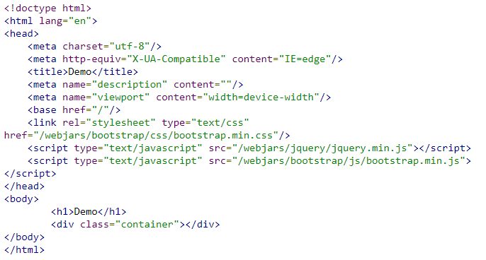

[Reading-notes](https://odehyazan.github.io/reading-notes/)

# Spring Boot and OAuth2

**All samples are implemented using the native OAuth 2.0 support in Spring Boot.**

**There are several samples building on each other, adding new features at each step:**

+ **simple: a very basic static app with just a home page and unconditional login via Spring Boot’s OAuth 2.0 configuration properties (if you visit the home page, you will be automatically redirected to GitHub).**

+ **click: adds an explicit link that the user has to click to login.**

+ **logout: adds a logout link as well for authenticated users.**

+ **two-providers: adds a second login provider so the user can choose on the home page which one to use.**

+ **custom-error: adds an error message for unauthenticated users, and a custom authentication based on GitHub’s API.**

**Each app can be imported into an IDE. You can run the `main` method in `SocialApplication` to start an app. They all come up with a home page on `http://localhost:8080` (and all require that you have at least a GitHub and Google account if you want to log in and see the content).**

**You can also run all the apps on the command line using `mvn spring-boot:run` or by building the jar file and running it with `mvn package` and `java -jar target/*.jar`. There is no need to install Maven if you use the wrapper at the top level, e.g.**

**`$ cd simple`**

**`$ ../mvnw package`**

**`$ java -jar target/*.jar`**

## Single Sign On With GitHub

**you’ll create a minimal application that uses GitHub for authentication. This will be quite easy by taking advantage of the autoconfiguration features in Spring Boot.**

### Creating a New Project

**First, you need to create a Spring Boot application, which can be done in a number of ways. The easiest is to go to [Spring Initializer](https://start.spring.io) and generate an empty project (choosing the "Web" dependency as a starting point). Equivalently, do this on the command line:**

**`$ mkdir ui && cd ui`**

**`$ curl https://start.spring.io/starter.tgz -d style=web -d name=simple | tar -xzvf -**`**

**You can then import that project into your favorite IDE (it’s a normal Maven Java project by default), or just work with the files and `mvn` on the command line.**

### Add a Home Page

**In your new project, create `index.html` in the `src/main/resources/static` folder. You should add some stylesheets and JavaScript links so the result looks like this:** 

**`index.html`** 
 

**None of this is necessary to demonstrate the OAuth 2.0 login features, but it’ll be nice to have a pleasant UI in the end, so you might as well start with some basic stuff in the home page.**

**If you start the app and load the home page, you’ll notice that the stylesheets have not been loaded. So, you need to add those as well by adding jQuery and Twitter Bootstrap:**
 

**`pom.xml`** 

 

**The final dependency is the webjars "locator" which is provided as a library by the webjars site. Spring can use the locator to locate static assets in webjars without needing to know the exact versions (hence the versionless `/webjars/**` links in the `index.html`). The webjar locator is activated by default in a Spring Boot app, as long as you don’t switch off the MVC autoconfiguration.**

### Securing the Application with GitHub and Spring Security

**To make the application secure, you can simply add Spring Security as a dependency. Since you’re wanting to do a "social" login (delegate to GitHub), you should include the Spring Security OAuth 2.0 Client starter:**

**`pom.xml`**  

 
**By adding that, it will secure your app with OAuth 2.0 by default.**

**Next, you need to configure your app to use GitHub as the authentication provider. To achieve this, do the following:**

+ **Add a New GitHub app**
+ **Configure application.yml**
+ **Boot up the application**

#### Add a New GitHub App

**To use GitHub’s OAuth 2.0 authentication system for login, you must first Add a new GitHub app.**

**Select "New OAuth App" and then the "Register a new OAuth application" page is presented. Enter an app name and description. Then, enter your app’s home page, which should be `http://localhost:8080`, in this case. Finally, indicate the Authorization callback URL as `http://localhost:8080/login/oauth2/code/github` and click Register Application.**

**The OAuth redirect URI is the path in the application that the end-user’s user-agent is redirected back to after they have authenticated with GitHub and have granted access to the application on the Authorize application page.**
