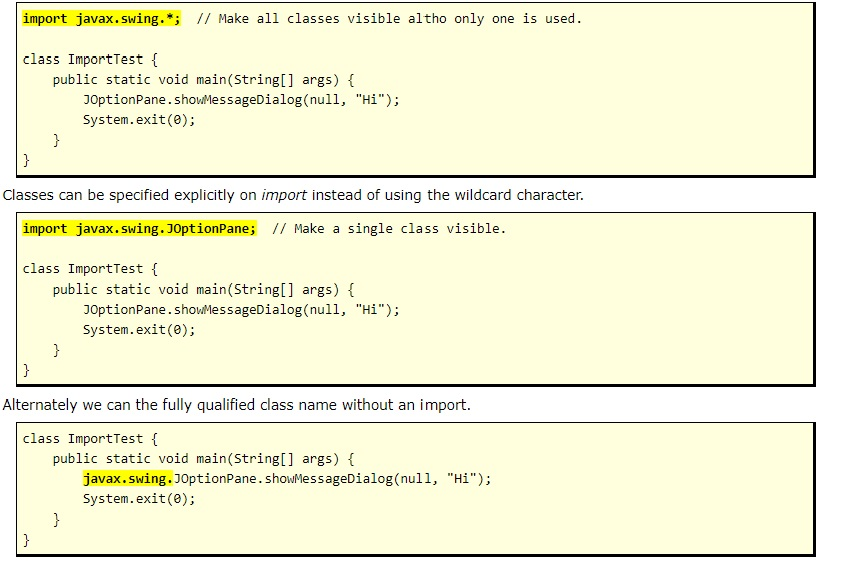

[Reading-notes](https://odehyazan.github.io/reading-notes/)

# Arrays, Loops, Imports

## Packages and Import

**Package = directory. Java classes can be grouped together in packages. A package name is the same as the directory (folder) name which contains the .java files. You declare packages when you define your Java program, and you name the packages you want to use from other libraries in an import statement.**

**Package in Java is a mechanism to encapsulate a group of classes, sub packages and interfaces. Packages are used for:**

**1. Preventing naming conflicts. For example there can be two classes with name Employee in two packages, college.staff.cse.Employee and college.staff.ee.Employee.**

**2. Making searching/locating and usage of classes, interfaces, enumerations and annotations easier.**

**3. Providing controlled access: protected and default have package level access control. A protected member is accessible by classes in the same package and its subclasses. A default member (without any access specifier) is accessible by classes in the same package only.**

**4. Packages can be considered as data encapsulation.**

### Package declaration syntax

**The statement order is as follows. Comments can go anywhere.**

**1. Package statement (optional).**
**2. Imports (optional).**
**3. Class or interface definitions.**

### Imports: three options

**The JOptionPane class is in the swing package, which is located in the javax package. The wildcard character (*) is used to specify that all classes with that package are available to your program. This is the most common programming style.**

### Common imports
|-----|-----|
|import java.awt.*;|Common GUI elements.|
|import java.awt.event.*;|The most common GUI event listeners.|
|import javax.swing.*;|More common GUI elements. Note "javax".|
|import java.util.*;|Data structures (Collections), time, Scanner, etc classes.|
|import java.io.*;|Input-output classes.|
|import java.text.*|Some formatting classes.|
|import java.util.regex.*;|Regular expression classes.|
