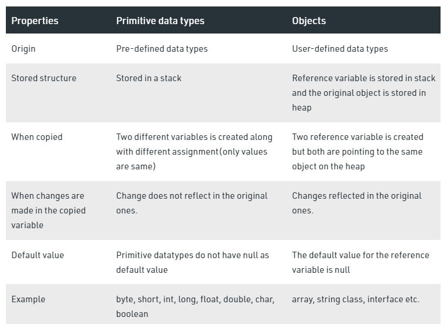

[Reading-notes](https://odehyazan.github.io/reading-notes/)

# Maps, primitives, File I/O

## Primitives vs. Objects

**Primitive Data Type: In Java, the primitive data types are the predefined data types of Java. They specify the size and type of any standard values. Java has 8 primitive data types namely byte, short, int, long, float, double, char and boolean. When a primitive data type is stored, it is the stack that the values will be assigned. When a variable is copied then another copy of the variable is created and changes made to the copied variable will not reflect changes in the original variable.**

**Object Data Type: These are also referred to as Non-primitive or Reference Data Type. They are so-called because they refer to any particular objects. Unlike the primitive data types, the non-primitive ones are created by the users in Java. Examples include arrays, strings, classes, interfaces etc. When the reference variables will be stored, the variable will be stored in the stack and the original object will be stored in the heap. In Object data type although two copies will be created they both will point to the same variable in the heap, hence changes made to any variable will reflect the change in both the variables.**

## Exceptions

**In Java “an event that occurs during the execution of a program that disrupts the normal flow of instructions” is called an exception. This is generally an unexpected or unwanted event which can occur either at compile-time or run-time in application code. Java exceptions can be of several types and all exception types are organized in a fundamental hierarchy.**

## Catch or Specify Requirement

**As stated previously, Java requires that a method either catch or specify all checked exceptions that can be thrown within the scope of the method. This requirement has several components that need further description: "catch", "specify," "checked exceptions," and "exceptions that can be thrown within the scope of the method."**

### Catch

**A method can catch an exception by providing an exception handler for that type of exception. The next page, Dealing with Exceptions, introduces an example program, talks about catching exceptions, and shows you how to write an exception handler for the example program.**

### Specify

**If a method chooses not to catch an exception, the method must specify that it can throw that exception,Why did the Java designers make this requirement?** **Because any exception that can be thrown by a method is really part of the method's public programming interface: callers of a method must know about the exceptions that a method can throw in order to intelligently and consciously decide what to do about those exceptions.** **Thus, in the method signature you specify the exceptions that the method can throw.**
**The next page, Dealing with Exceptions, talks about specifying exceptions that a method throws and shows you how to do it.**

### Checked Exceptions

**Java has different types of exceptions, including I/O Exceptions, runtime exceptions, and exceptions of your own creation, to name a few. Of interest to us in this discussion are runtime exceptions. Runtime exceptions are those exceptions that occur within the Java runtime system. This includes arithmetic exceptions (such as when dividing by zero), pointer exceptions (such as trying to access an object through a null reference), and indexing exceptions (such as attempting to access an array element through an index that is too large or too small).**
**Runtime exceptions can occur anywhere in a program and in a typical program can be very numerous. The cost of checking for runtime exceptions often exceeds the benefit of catching or specifying them. Thus the compiler does not require that you catch or specify runtime exceptions, although you can. Checked exceptions are exceptions that are not runtime exceptions and are checked by the compiler; the compiler checks that these exceptions are caught or specified.**

## How to Throw Exceptions

**Before you can catch an exception, some code somewhere must throw one. Any code can throw an exception: your code, code from a package written by someone else such as the packages that come with the Java platform, or the Java runtime environment. Regardless of what throws the exception, it's always thrown with the throw statement.**

**All methods use the throw statement to throw an exception. The throw statement requires a single argument: a throwable object. Throwable objects are instances of any subclass of the Throwable class. Here's an example of a throw statement.**

**`throw someThrowableObject;`**

**Throwable Class and Its Subclasses**
**The objects that inherit from the Throwable class include direct descendants (objects that inherit directly from the Throwable class) and indirect descendants (objects that inherit from children or grandchildren of the Throwable class).** **The figure below illustrates the class hierarchy of the Throwable class and its most significant subclasses. As you can see, Throwable has two direct descendants: Error and Exception.**

**Error Class**
**When a dynamic linking failure or other hard failure in the Java virtual machine occurs, the virtual machine throws an Error. Simple programs typically do not catch or throw Errors.**

**Exception Class**
**Most programs throw and catch objects that derive from the Exception class. An Exception indicates that a problem occurred, but it is not a serious system problem. Most programs you write will throw and catch Exceptions as opposed to Errors.**

## Scanning

**Objects of type Scanner are useful for breaking down formatted input into tokens and translating individual tokens according to their data type.**

### Breaking Input into Tokens

**By default, a scanner uses white space to separate tokens. (White space characters include blanks, tabs, and line terminators. For the full list, refer to the documentation for Character.isWhitespace.) To see how scanning works, let's look at ScanXan, a program that reads the individual words in xanadu.txt and prints them out, one per line.**

### Translating Individual Tokens

**The ScanXan example treats all input tokens as simple String values. Scanner also supports tokens for all of the Java language's primitive types (except for char), as well as BigInteger and BigDecimal. Also, numeric values can use thousands separators. Thus, in a US locale, Scanner correctly reads the string "32,767" as representing an integer value.**