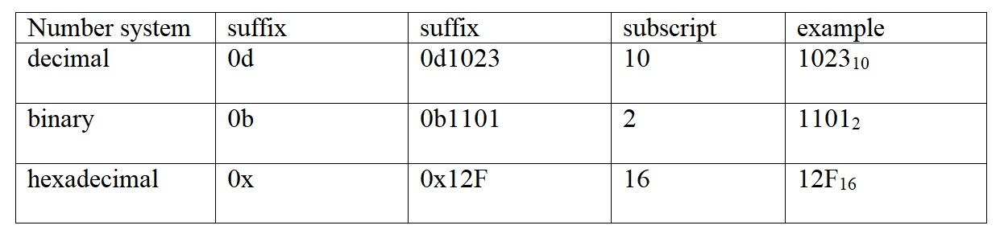
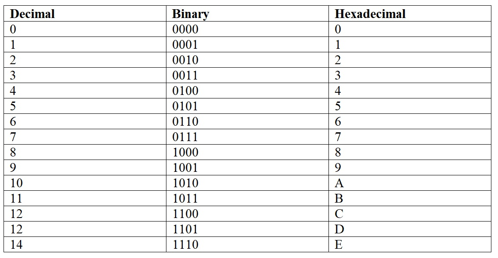

[Reading-notes](https://odehyazan.github.io/reading-notes/)

## OOP

**OOPs stands for Object-oriented programming. OOPs in Java organizes a program around the various objects and well-defined interfaces. The OOPs Concepts in Java are abstraction, encapsulation, inheritance, and polymorphism. These concepts aim to implement real-world entities in programs.**

**Bundling code into individual software objects benefits:**

**1. Modularity: The source code for an object can be written and maintained independently of the source code for other objects. Once created, an object can be easily passed around inside the system.**

**2. Information-hiding: By interacting only with an object's methods, the details of its internal implementation remain hidden from the outside world.**

**3. Code re-use: If an object already exists (perhaps written by another software developer), you can use that object in your program. This allows specialists to implement/test/debug complex, task-specific objects, which you can then trust to run in your own code.**

**4. Pluggability and debugging ease: If a particular object turns out to be problematic, you can simply remove it from your application and plug in a different object as its replacement. This is analogous to fixing mechanical problems in the real world. If a bolt breaks, you replace it, not the entire machine.**

## CLASS

**A class is a template or blueprint from which objects are created. So, an object is the instance(result) of a class.**

## Binary, Decimal and Hexadecimal Numbers
 
 ***Base 10 and Positional Number Systems.***

**We are all familiar with the base 10 number system that we use in our every day lives. The base 10 number system is just one example of a positional number system. In a positional number system a number is represented as a series of digits, where each digit position is associated with a weight. For example, the number representing the year 2003 can be represented as follows:**

**2003 = 2 * 103 + 0 * 102 + 0 * 101 + 3 * 100**

**position 3	2	1	0**

**As you can see, each weight is the power of 10 to the number position starting at 0.**
**The represents multiplication and any number raised to the power of zero = 1;**

***Binary and Hexadecimal Number Systems.***

**Binary and Hexadecimal number systems are examples of positional number systems with different bases. Binary number systems use a base of two while hexadecimal uses a base of 16.**

**For example, the binary number 1010 is represented as follows:**

**1011 = 1 * 23 + 0 * 22  + 1 * 21 + 1 * 20  = 1 * 8 + 0 * 4 + 1 * 2 + 1 * 1 = 11 (base 10).**

**For example, the hexadecimal number 123 is represented as:**

**follows: 123 = 1 * 162 + 2 * 161 + 3 * 160 * 0 = 1 * 256 + 32 + 3 = 291 (base 10).**

**In a hexadecimal system, it is necessary to count to 15. To represent the numbers 10 – 15, the letters A – F are used respectively. To distinguish the different number systems, suffixes or subscripts are often used.**

**The following table compares all three systems counting from 0 to 15.**
